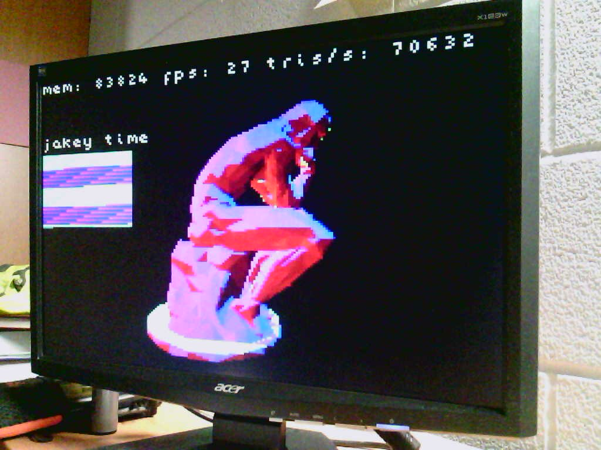
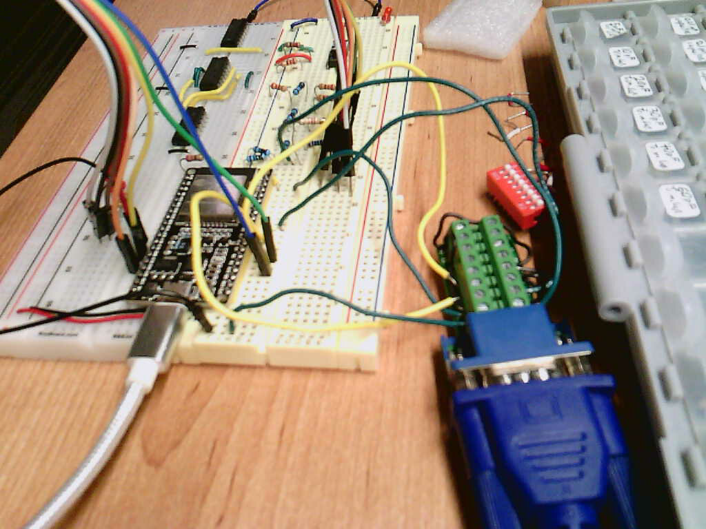

(See bottom of this file for DerfTastic's additions)

# bitluni's ESP32 VGA
A simple VGA output with 14Bit color and external DACs over parallel I²S

Thanks for any support!

Patreon (https://patreon.com/bitluni)
Paypal (https://paypal.me/bitluni)

Version 0.1

#License
bitluni 2019
Creative Commons Attribution ShareAlike 2.0
https://creativecommons.org/licenses/by-sa/2.0/

If you need another license, please feel free to contact me

# DerfTastic's Additions (so far)

- Got the project to work on my ESP-WROOM-32S development board with the [PlatfromIO](https://platformio.org/) extension for VSCode.
- Got one of my own models of a table in the `gfx/` folder to work

This was my first time actually using an ESP32 so I was really surprise at how fast it actually is. I'll probably be using this more than my arduino for quick microcontroller things now.

### Future plans:

- Allow button input to be taken in so that a game can actually be made
- Make an interface to draw 2D sprites